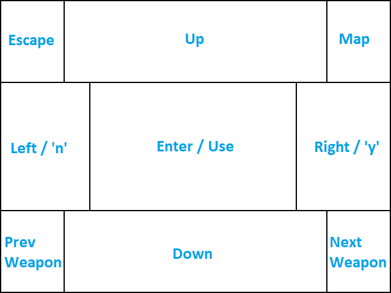
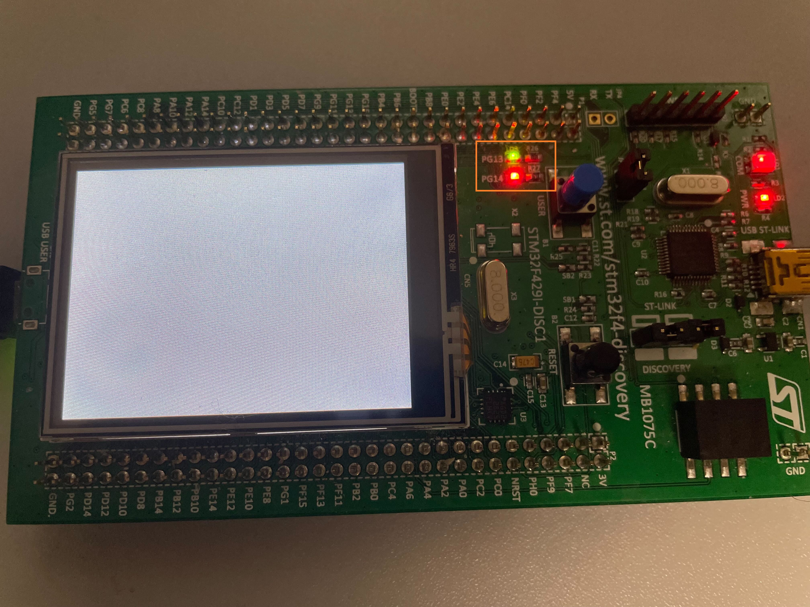
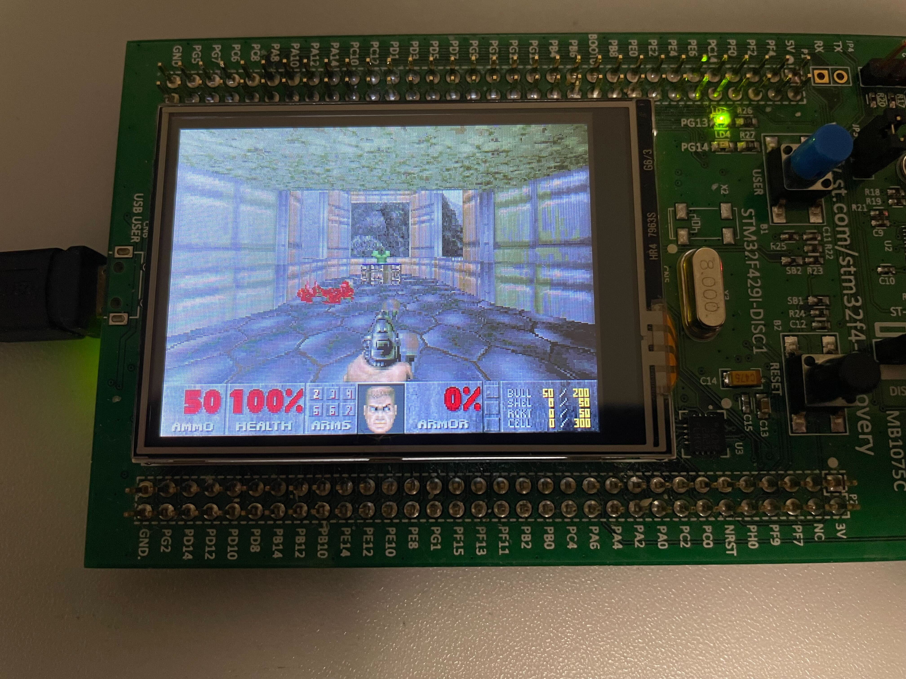
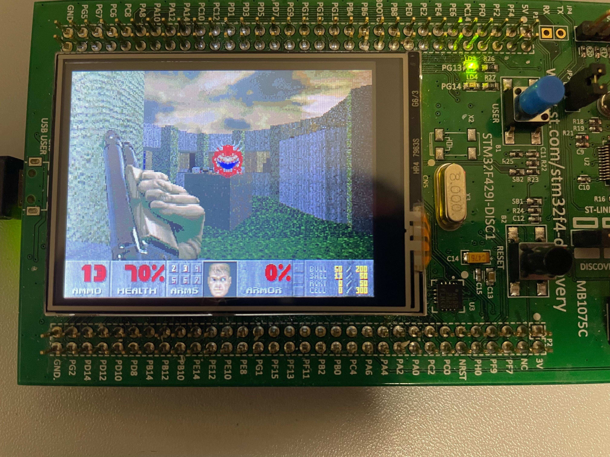
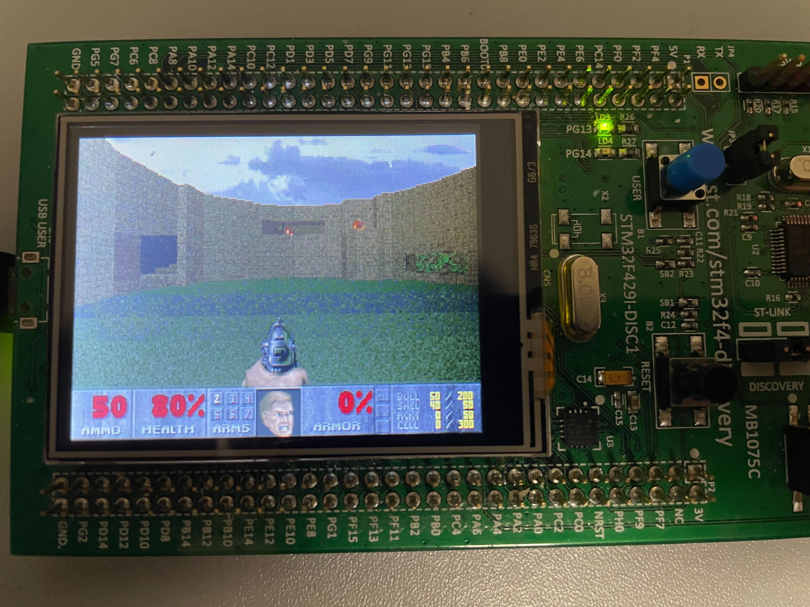
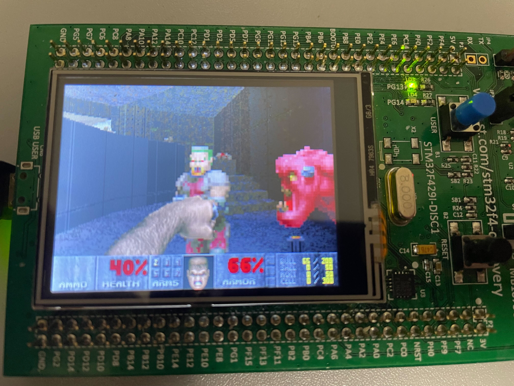

# STM32DISCOVERY_DOOM
 
A [doomgeneric](https://github.com/ozkl/doomgeneric) port capable of running all of the official doom iwads.

# Hardware requirements

- [STM32F429I-DISC1](https://www.st.com/en/evaluation-tools/32f429idiscovery.html)
- USB OTG cable
- USB flash drive formatted as FAT32

# Controls

Game controls use both the on display touch sensor and the user button (the blue button on the board).

This is the control mapping for the touch screen:

The user button is mapping:
- While in a menu, it sends "Key enter"
- While in a game, it sends "Key fire"

# Flashing

The compiled firmware can be found in the build/ folder, you can use [STM32CubeProgrammer](https://www.st.com/en/development-tools/stm32cubeprog.html) to flash it to the board.

Or, you can download [STM32CubeIDE](https://www.st.com/en/development-tools/stm32cubeide.html), open this folder as an existing project and flash it that way.

You will also need an USB flash drive, formatted as FAT32, that containts at least one of the following:
- doom1.wad
- doom.wad
- doom2.wad
- plutonia.wad
- tnt.wad

At the the root of your flash drive. Other iwads may work, altough they haven't been tested.

Inside Core/Src/main.c, line 158 you can change which iwad file should be loaded. The precompiled firmware in build/ folder will look for doom.wad

# Status LEDs

Two on-board status LEDs are utilized to communicate the current state of the MCU and the DOOM engine. The meaning of them is as follows:
- Green and red LEDs are on: System is initalizing and waiting for USB to be detected
- Green LED is on: System is running
- Red LED is on: System error or DOOM engine error

# Debugging
DOOM engine debug output can be observed from the serial port that the ST-Link chip exposes, the paramaters are 115200/8/1/n.

# Screenshots

## Doom

## Doom 2

## The Plutonia Experiment

## TNT: Evilution

